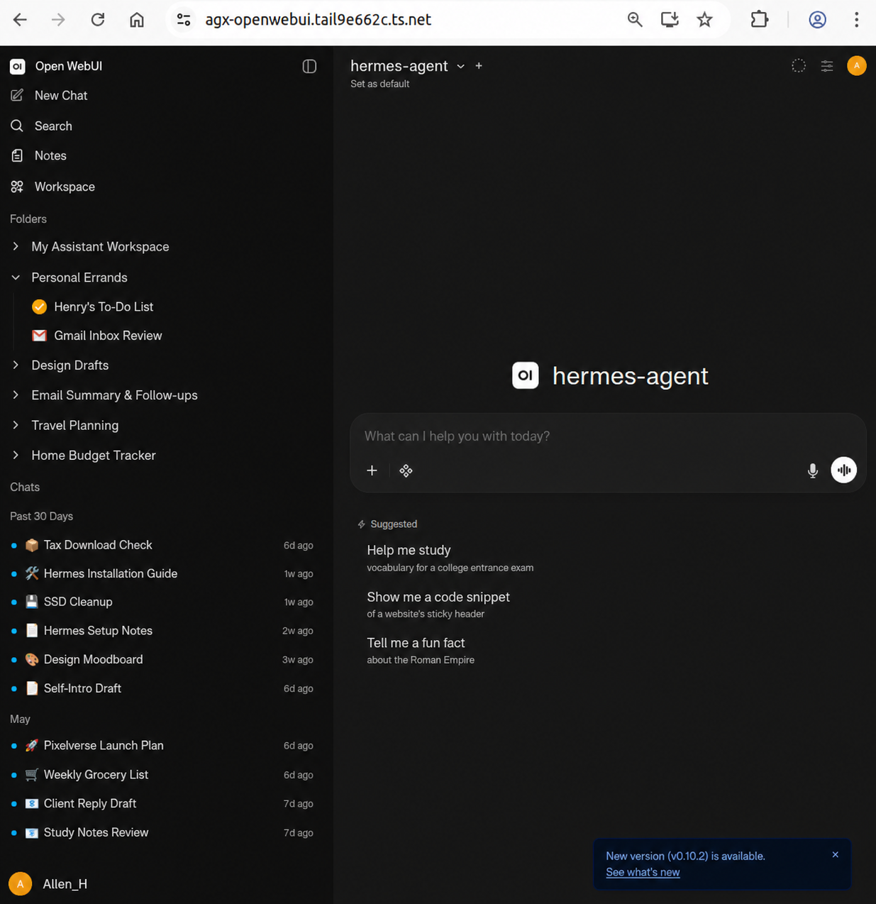
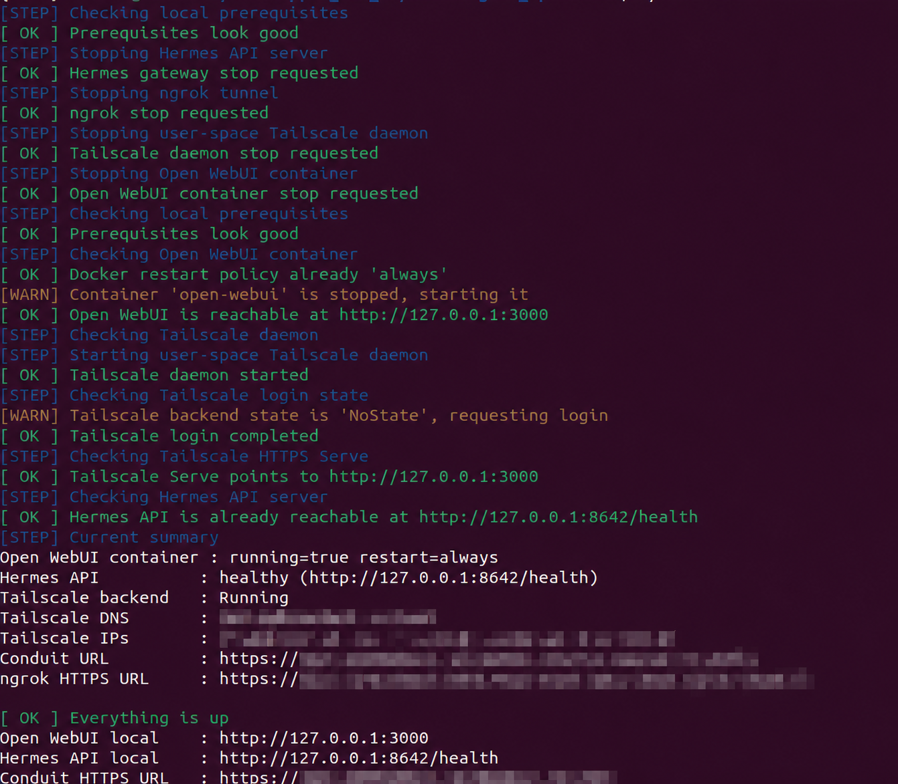

# HermesOpenWebUI QuicklyLaunch

[English](README.en.md)

HermesOpenWebUI QuicklyLaunch 是一套 Linux 快速啟動工具，幫你把 Hermes Agent、Open WebUI 與 Tailscale HTTPS Serve 串起來。安裝完成後，可以用 `./run.sh` 管理啟動、重啟、更新、狀態檢查與 logs。

<table>
  <tr>
    <td align="center">
      <a href="img/openwebui.png">
        
      </a>
      <br>
      <sub><strong>Open WebUI 安裝完成後的畫面</strong></sub>
    </td>
  </tr>
</table>

<table>
  <tr>
    <td align="center">
      <a href="img/run-command.png">
        
      </a>
      <br>
      <sub><strong>run.sh 一鍵啟動流程</strong></sub>
    </td>
  </tr>
</table>

## 會安裝與啟動什麼

| 元件 | 啟動方式 | 用途 |
| --- | --- | --- |
| Hermes Agent | 從官方 GitHub repository 下載，使用 Python virtual environment 啟動 gateway | 提供 OpenAI-compatible API |
| Open WebUI | 使用官方 Docker image `ghcr.io/open-webui/open-webui:main` | 提供聊天網頁介面 |
| Tailscale Serve | 使用本機 user-space Tailscale daemon | 提供 tailnet HTTPS 入口 |

這個專案不需要 Dockerfile。Open WebUI 直接使用官方 Docker image；Hermes Agent 由 `run.sh` 下載後以 Python 環境啟動。

## 系統需求

- Linux
- Docker
- git
- curl
- python3
- Tailscale 帳號與 tailnet 權限
- 可選：uv，可加速 Python 環境安裝

## 快速開始

```bash
git clone https://github.com/a0665x/HermesOpenWebUI_QuicklyLaunch.git
cd HermesOpenWebUI_QuicklyLaunch
./run.sh install
./run.sh up
```

第一次啟動 Tailscale 時，終端機可能會顯示登入或授權連結。完成授權後，再執行一次：

```bash
./run.sh up
```

啟動成功後，預設可使用：

```text
Open WebUI local : http://127.0.0.1:3000
Hermes health    : http://127.0.0.1:8642/health
Tailscale HTTPS  : 依照 ./run.sh status 顯示的 Conduit URL
```

## 常用指令

```bash
./run.sh install      # 安裝 Hermes、Open WebUI container、Tailscale 基本環境
./run.sh up           # 啟動或修復整套服務
./run.sh restart      # 停止後重新啟動
./run.sh rebuild      # 更新 Open WebUI image、重建 container，並更新 Hermes checkout
./run.sh status       # 顯示目前狀態與 URL
./run.sh doctor       # 檢查依賴與路徑設定
./run.sh logs         # 顯示近期 logs
./run.sh stop         # 停止 Hermes、Tailscale daemon、Open WebUI
```

也支援 wrapper 形式：

```bash
./run.sh --command restart
./run.sh --commend restart
```

## 健康檢查

```bash
./healthcheck.sh
```

健康檢查會確認：

- Open WebUI container 是否存在並可連線
- Hermes API health endpoint 是否正常
- Tailscale backend 是否 Running
- Tailscale Serve 是否指向 Open WebUI
- Tailscale MagicDNS 是否可解析
- HTTPS 入口是否可開啟

如果 HTTPS URL 在其他裝置可開，但這台機器打不開，通常是 MagicDNS 沒有接上，可嘗試：

```bash
./healthcheck.sh --fix-dns
```

## Hermes 與 Open WebUI 串接

`./run.sh install` 會準備 Hermes API key，並在建立 Open WebUI container 時自動設定 OpenAI-compatible API base：

```text
http://host.docker.internal:8642/v1
```

因此 Open WebUI container 會透過這個位址呼叫 Hermes gateway。

## 更新

```bash
./run.sh rebuild
./run.sh up
./healthcheck.sh
```

`rebuild` 會更新 Open WebUI image 並重新建立 container；Open WebUI 的 Docker volume 會保留。

## 設定

可用環境變數覆蓋預設值：

```bash
HERMES_REPO_URL=https://github.com/NousResearch/hermes-agent.git
HERMES_REF=main
TS_HOSTNAME=agx-openwebui
OPENWEBUI_CONTAINER=open-webui
OPENWEBUI_LOCAL_URL=http://127.0.0.1:3000
OPENWEBUI_IMAGE=ghcr.io/open-webui/open-webui:main
```

API key 與模型 provider key 可放在：

```text
~/.hermes/.env
```

可先參考 `.env.example`，但不要把真實金鑰提交到 GitHub。
